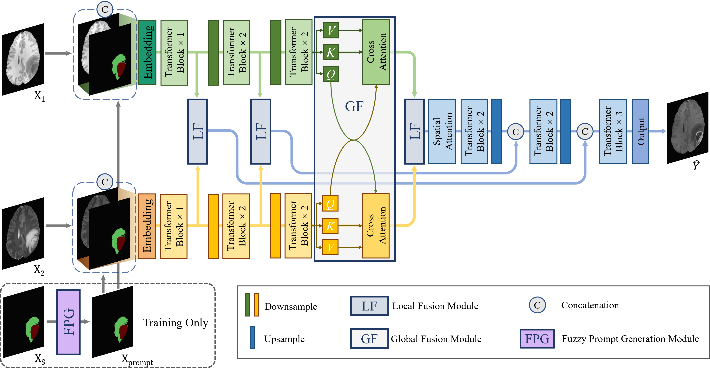

# Interactive Gadolinium-Free MRI Synthesis: A Transformer with Localization Prompt Learning



## 1. Create Environment
- Create Conda Environment
```
conda create -n tlp python=3.8
conda activate tlp
```
- Install Dependencies
```
conda install pytorch==1.13.0 torchvision==0.14.0 pytorch-cuda=11.6 -c pytorch -c nvidia
pip install -r requirements.txt
```

## 2. Download Dataset

You can download the [BRaTS 2021 Training Dataset](https://www.kaggle.com/datasets/dschettler8845/brats-2021-task1), extract it, and place it in your dataset folder while keeping track of the path.

You should organize your dataset folder in the following format:
```
    your_dataset_folder/
        BraTS2021/
            BraTS2021_00000/
                BraTS2021_00000_flair.nii.gz
                BraTS2021_00000_seg.nii.gz
                BraTS2021_00000_t1.nii.gz
                BraTS2021_00000_t1ce.nii.gz
                BraTS2021_00000_t2.nii.gz
                
            ...
            
            BraTS2021_01100/
                BraTS2021_01100_flair.nii.gz
                BraTS2021_01100_seg.nii.gz
                BraTS2021_01100_t1.nii.gz
                BraTS2021_01100_t1ce.nii.gz
                BraTS2021_01100_t2.nii.gz
                
            ...
```
##  3. Training
Generative models are highly sensitive to dataset quality. Therefore, many studies remove low-quality images when training generative models using datasets originally designed for segmentation tasks. The data_list folder stores the 1,000 case IDs we have filtered. We found that training after removing low-quality cases significantly improves the model's generation performance. Therefore, we strongly recommend using the filtered data for training. It is worth noting that some of these 1,000 cases still contain slight artifacts, but that's okay. Slight variations in image quality may help improve the model's robustness.
```shell
python3 train.py --dataroot /path/to/your/dataset/
```

##  4. Testing
```shell
python3 test.py --dataroot /path/to/your/dataset/
```

## Citation
If you find our work useful for your research, please cite our paper. 

```
@article{li2025interactive,
  title={Interactive Gadolinium-Free MRI Synthesis: A Transformer with Localization Prompt Learning},
  author={Li, Linhao and Su, Changhui and Guo, Yu and Zhang, Huimao and Liang, Dong and Shang, Kun},
  journal={arXiv preprint arXiv:2503.01265},
  year={2025}
}
```
## Acknowledgements
Some model files are modified from [Restormer](https://github.com/swz30/Restormer) and [Text-IF](https://github.com/XunpengYi/Text-IF).

